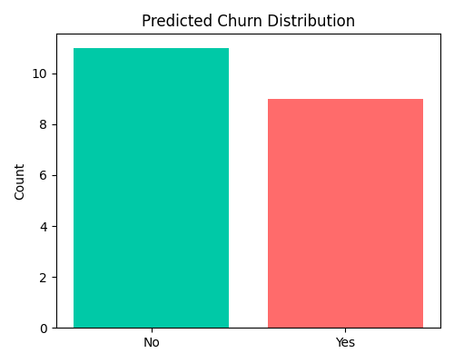

# 📉 Customer Churn Predictor

A machine learning web app that predicts customer churn using **XGBoost** with **SHAP explainability**, built with Flask and trained on the IBM Telco Customer Churn dataset.

> Built by **Aryan Diwan**

---

## 🚀 Demo

Upload a customer CSV file → Get churn predictions, risk levels, and model performance metrics instantly.



---

## ✨ Features

- 🤖 **XGBoost model** trained on IBM Telco Customer Churn data (ROC-AUC: **0.838**)
- 🔍 **SHAP explainability** — understand why the model makes each prediction
- 📊 **Interactive results page** with churn distribution, risk levels, and confusion matrix
- ⚙️ **Feature engineering** — tenure grouping, charges per tenure, service count, high-value flag
- 🎯 **Risk segmentation** — Low / Medium / High risk per customer
- 📈 **Full metrics** — Accuracy, Precision, Recall, F1, ROC-AUC, Log Loss (when labels provided)

---

## 🗂️ Project Structure

```
customer-churn-predictor/
│
├── app.py                  # Flask web application
├── train.py                # Model training pipeline
├── requirements.txt        # Python dependencies
├── setup_env.bat           # Windows environment setup script
│
├── model/                  # Trained model artifacts
│   ├── xgb_churn.json      # XGBoost model
│   ├── scaler.pkl          # StandardScaler
│   ├── label_encoders.pkl  # LabelEncoders for categorical features
│   └── feature_names.pkl   # Feature name list
│
├── templates/              # Flask HTML templates
│   ├── index.html          # Upload page
│   └── results.html        # Prediction results page
│
├── static/                 # CSS and generated charts
│   ├── style.css
│   ├── confusion_matrix.png
│   ├── churn_distribution.png
│   ├── risk_distribution.png
│   ├── roc_curve.png
│   ├── feature_importance.png
│   └── shap_summary.png
│
└── data/
    └── WA_Fn-UseC_-Telco-Customer-Churn.csv   # Training dataset
```

---

## ⚙️ Setup & Installation

### Option 1 — Windows (Automated)

```bash
# Run the setup script to create venv and install dependencies
setup_env.bat
```

### Option 2 — Manual (Windows / Mac / Linux)

```bash
# 1. Clone the repository
git clone https://github.com/BitBreweer/customer-churn-predictor.git
cd customer-churn-predictor

# 2. Create a virtual environment
python -m venv venv

# 3. Activate it
# Windows:
venv\Scripts\activate
# Mac/Linux:
source venv/bin/activate

# 4. Install dependencies
pip install -r requirements.txt
```

---

## 🏋️ Training the Model (Optional)

The pre-trained model is included in `model/`. To retrain from scratch:

1. Place the dataset at `data/WA_Fn-UseC_-Telco-Customer-Churn.csv`  
   *(Download from [Kaggle](https://www.kaggle.com/datasets/blastchar/telco-customer-churn))*

2. Run the training script:

```bash
python train.py
```

This will output:
- `model/xgb_churn.json` — trained model
- `model/scaler.pkl`, `label_encoders.pkl`, `feature_names.pkl` — preprocessing artifacts
- `static/` — evaluation plots (confusion matrix, ROC curve, SHAP summary, feature importance)

---

## ▶️ Running the App

```bash
python app.py
```

Then open your browser and go to: **http://127.0.0.1:5000**

---

## 📋 Input CSV Format

Your CSV should include these columns (same as the IBM Telco dataset):

| Column | Description |
|---|---|
| `customerID` | Unique customer identifier (optional) |
| `tenure` | Months as a customer |
| `MonthlyCharges` | Monthly bill amount |
| `TotalCharges` | Total amount charged |
| `Contract` | Month-to-month / One year / Two year |
| `InternetService` | DSL / Fiber optic / No |
| `OnlineSecurity`, `TechSupport`, etc. | Service subscriptions |
| `Churn` | Yes / No *(optional — enables metrics if present)* |

You can test with the included `sample_test.csv`.

---

## 📊 Model Performance

| Metric | Score |
|---|---|
| ROC-AUC | **0.838** |
| 5-Fold CV AUC | reported during training |
| Accuracy | computed on upload if labels present |
| F1 Score | computed on upload if labels present |

### Top Predictive Features

1. **Contract type** — strongest predictor (month-to-month = high risk)
2. **OnlineSecurity** — customers without it churn more
3. **TechSupport** — lack of support correlates with churn
4. **InternetService** — fiber optic users churn more
5. **tenure_group** — newer customers are higher risk

---

## 🛠️ Tech Stack

| Layer | Technology |
|---|---|
| Model | XGBoost |
| Explainability | SHAP |
| Web Framework | Flask |
| Data Processing | Pandas, NumPy, Scikit-learn |
| Visualizations | Matplotlib, Seaborn |
| Frontend | Bootstrap 5, custom CSS |

---

## 📄 License

MIT License — free to use and modify.

---

## 🙋 Author

**Aryan Diwan**  
Feel free to open issues or submit pull requests!
